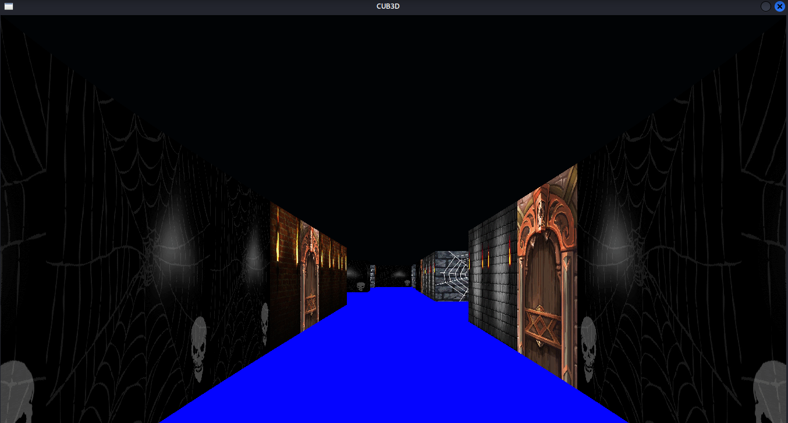

# cub3D

> A 3D graphical project inspired by the classic game Wolfenstein 3D, developed as part of the 1337/42 curriculum. This project uses raycasting to render a simple 3D world from a 2D map.

---


## 🧠 Project Overview

**cub3D** is an individual project designed to introduce students to **basic 3D rendering**, **raycasting algorithms**, and **event-driven programming** using the **MiniLibX graphics library**. The player can explore a world based on a 2D map with walls, textures, and movement mechanics, all visualized from a first-person perspective.

---

## 🎯 Objectives

- Implement a raycasting engine (like in Wolfenstein 3D).
- Handle keyboard input for movement (W, A, S, D + arrows).
- Parse a `.cub` configuration map.
- Render walls with textures and support a minimap (bonus).
- Ensure smooth player rotation and movement.

---

## 🛠 Technologies

- **C language**
- **MiniLibX** (graphics library)
- **macOS / Linux** support
- **Makefile** for build automation

---

🚀 How to Run
1. Install MiniLibX
On macOS:
```
brew install mlx
```
On Linux:
MiniLibX is not officially packaged, so you need to clone and install it manually:

```
sudo apt-get install libxext-dev libx11-dev libbsd-dev
git clone https://github.com/42Paris/minilibx-linux.git
cd minilibx-linux
make
```

2. Clone the cub3D Repository
```
git clone https://github.com/yourusername/cub3D.git
cd cub3D
```
3. Compile the Project
```
make
```
If using the Linux version of MiniLibX, make sure the Makefile is configured to link with the correct path and libraries (e.g. -lXext -lX11 -lm -lbsd)

4. Run the Program
```
./cub3D mandatory/map/map.cub
```
